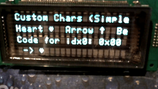
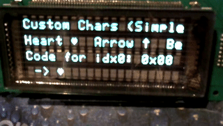

# VFDDisplay

High-level Arduino library for character Vacuum Fluorescent Displays (VFDs) with a clean HAL (device layer) and a buffered top layer for smooth animations. Includes many ready-to-run demos for Arduino Mega 2560.

## Run All Demos

Use the helper script to build and upload every example sequentially with a countdown between demos.

- Script: `./run_all_demos.sh`
- Defaults: PlatformIO backend, port `/dev/ttyACM0`, wait 60s, protocol `stk500`, baud `57600`.

Examples:

- PlatformIO backend (override protocol/baud/port/wait):
  - `./run_all_demos.sh --backend pio --port /dev/ttyACM0 --wait 30 --protocol wiring --baud 115200`
- Make backend (mirrors your working manual command):
  - `./run_all_demos.sh --backend make --port /dev/ttyACM0 --wait 30 --protocol wiring --baud 115200`

Notes:
- Curated order: SimpleDemo → AdDemo → ClockDemo → BargraphDemo → AnimationsDemo → MatrixRainDemo → FlappyBirdDemo → MinimalVFDDemo → SimpleVFDTest → BasicTest → CorrectCodesDemo → ModeSpecificTest, then any remaining.
- PlatformIO backend uses a temporary per‑demo project that overrides upload protocol/baud, so flags are honored across PlatformIO versions.
- The script continues on errors, prints a visible countdown between demos, and summarizes results at the end.

## Gallery

Short clips from selected examples running on a 4×20 VFD:






## Build Single Demo

- PlatformIO: `pio run -d examples/ClockDemo -e megaatmega2560 -t upload --upload-port /dev/ttyACM0`
- Make: `make ClockDemo.upload PORT=/dev/ttyACM0 PROTOCOL=stk500 BAUD=57600`

## Standardized Demo Init

All demos call the same initialization sequence after `vfd->init()` to ensure a clean start:

```
vfd->reset();
vfd->clear();
vfd->cursorHome();
```

## Custom Characters

Define and render device‑agnostic custom glyphs using a simple, row‑major pattern format.

- Define: `vfd->setCustomChar(index, patternRows);`
  - `patternRows` is one byte per row; bits 0..(W-1) represent columns left→right.
  - The number of rows to provide is the device character height (e.g., 7 for 5x7, 8 for 5x8). Extra rows are ignored by devices that don’t use them.
- Display: `vfd->writeCustomChar(index);` (preferred) or query the raw device code via `vfd->getCustomCharCode(index, codeOut);` and then `vfd->writeChar(codeOut);`
- VFD20S401 mapping: supports up to 16 user‑defined glyphs. Indices 0–7 map to 0x00–0x07; indices 8–15 map to 0x80–0x87 to avoid control code collisions. Using `writeCustomChar()` abstracts this mapping.

Example (5x7/5x8 pattern):

```cpp
uint8_t heart[8] = {
  0b00000,
  0b01010,
  0b11111,
  0b11111,
  0b01110,
  0b00100,
  0b00000,
  0b00000 // ignored on 5x7 devices
};
vfd->setCustomChar(0, heart);
vfd->writeCustomChar(0);
```

Animation tip: reprogram a logical index (e.g., 0) with a different frame each tick using `setCustomChar()` and write it at the new position with `writeCharAt()`.

Related examples:
- `examples/CustomCharsSimple` – basic definition and rendering
- `examples/CustomCharsAdvanced` – up to 16 glyphs with mapping queries
- `examples/CustomCharsAnimation` – sprite animation by redefining a glyph
- `examples/CustomCharsTetris` – mini auto‑drop Tetris using a custom block glyph

## Documentation

- Library docs: `docs/README.md` (command reference, gotchas, examples)
- HAL Authoring Guide: `docs/api/HAL_Authoring_Guide.md` (step‑by‑step for adding new device HALs)

## Makefile Quickstart

Use the unified root `Makefile` to build and upload examples.

- List examples: `make list`
- Build an example (default backend PlatformIO): `make <ExampleName>`
- Upload (set your port): `make <ExampleName>.upload PORT=/dev/ttyACM0`
- Force backend: add `-- --pio` or `-- --arduino` or `-- --avr` after `make`.
- Launch VFDSender GUI: `make vfd-sender`

Examples
- `make -- --pio ClockDemo`
- `make -- --arduino BasicTest`
- `make -- --avr MinimalVFDDemo`
