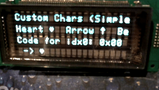
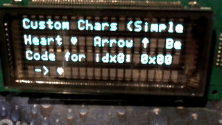

# VFDDisplay Library Usage Examples

## Overview

This document provides comprehensive usage examples for the VFDDisplay library, demonstrating various features and programming patterns. All examples are designed to work with the VFD20S401 4x20 character display connected via serial interface.

## Example Catalog

Below is a catalog of the example sketches shipped with this library. Build via the root Makefile (`make list` to enumerate), or open in Arduino IDE/PlatformIO.

- SimpleDemo — minimal unbuffered usage: init, clear, write, position.
- BasicTest — broad library sanity: positioning, center, brightness, custom chars.
- SimpleVFDTest — very small hardware check pattern.
- MinimalVFDDemo — essential operations in a compact sketch.
- CorrectCodesDemo — demonstrates corrected control/escape codes and sequencing.
- ModeSpecificTest — iterates through display DCs (0x11–0x13) and exercises cursor DCs (0x14–0x17).
- ClockDemo — buffered HH:MM:SS clock with blinking colon.
- BargraphDemo — buffered bargraphs across rows with labels.
- AnimationsDemo — buffered animation sampler (movement/fades).
- MatrixRainDemo — digital rain effect using BufferedVFD.
- FlappyBirdDemo — autonomous Flappy Bird on a 4×20 grid.
- AdDemo — animated “ad” with fades and marquee effects.
- CursorDemo — cycles display DCs (0x11–0x13), toggles cursor (DC4–DC7) and demonstrates blink and wrapping.
- StarWarsDemo — buffered Star Wars intro crawl with starfield and perspective trimming.
- CustomCharsSimple — define and show a few custom glyphs.
- CustomCharsAdvanced — explore 8/16 custom glyphs with mapping queries.
- CustomCharsAnimation — animate a sprite by redefining a glyph index.
- CustomCharsTetris — tiny auto‑drop Tetris using custom block glyph.
- BlinkExplore — probe cursor blink commands/speeds on Futaba 20S401.

Notes
- Use the helper: `./run_all_demos.sh` to sequentially build/upload many of these.
- Makefile: `make <Example>` then `make <Example>.upload PORT=/dev/ttyACM0`.

## Gallery

Short clips from selected examples running on a 4×20 VFD:






## Basic Examples

### Example 1: Simple Text Display
```cpp
#include "VFDDisplay.h"
#include "HAL/VFD20S401HAL.h"
#include "Transports/SerialTransport.h"

VFD20S401HAL* hal = new VFD20S401HAL();
SerialTransport* transport = new SerialTransport(&Serial1);
VFDDisplay* vfd = new VFDDisplay(hal, transport);

void setup() {
    Serial.begin(57600); // Debug serial
    Serial1.begin(19200, SERIAL_8N2); // VFD serial
    
    if (!vfd->init()) {
        Serial.println("VFD initialization failed!");
        return;
    }
    
    vfd->clear();
    vfd->write("Hello, World!");
    vfd->writeAt(1, 0, "Second line");
    vfd->writeAt(2, 0, "Third line");
    vfd->writeAt(3, 0, "Fourth line");
}

void loop() {
    // Static display - no updates needed
}
```

### Example 2: Centered Text Display
```cpp
void displayCenteredMessage() {
    vfd->clear();
    
    // Center text on each row
    vfd->centerText("=== TITLE ===", 0);
    vfd->centerText("Centered Text", 1);
    vfd->centerText("On All Rows", 2);
    vfd->centerText("=== END ===", 3);
    
    delay(3000);
}
```

### Example 3: Positioned Text Writing
```cpp
void displayPositionedText() {
    vfd->clear();
    
    // Write at specific positions
    vfd->writeAt(0, 0, "Top Left");
    vfd->writeAt(0, 12, "Top Right");
    vfd->writeAt(1, 5, "Centered");
    vfd->writeAt(2, 0, "Bottom Left");
    vfd->writeAt(3, 10, "Bottom Right");
    
    // Write individual characters
    vfd->writeCharAt(1, 0, '>');
    vfd->writeCharAt(1, 19, '<');
    vfd->writeCharAt(2, 19, '*');
    vfd->writeCharAt(3, 0, '*');
}
```

## Cursor Control Examples

### Example 4: Cursor Movement and Control
```cpp
void demonstrateCursor() {
    vfd->clear();
    
    // Set cursor position and write
    vfd->setCursorPos(0, 0);
    vfd->write("Cursor at (0,0)");
    
    delay(1000);
    
    // Move cursor and write more
    vfd->setCursorPos(1, 5);
    vfd->write("Moved to (1,5)");
    
    delay(1000);
    
    // Use cursor movement commands
    vfd->setCursorPos(2, 0);
    vfd->write("Testing cursor");
    vfd->backSpace(); // Backspace
    vfd->writeChar('X'); // Replace last character
    
    // Tab and new line
    vfd->setCursorPos(3, 0);
    vfd->write("Tab:");
    vfd->hTab();
    vfd->write("Tabbed text");
}
```

### Example 5: Cursor Blinking
```cpp
void demonstrateCursorBlink() {
    vfd->clear();
    vfd->write("Cursor Blink Demo");
    
    // Ensure cursor is visible (DC5), then control blink via ESC 'T' + rate
    vfd->setCursorMode(1); // DC5: cursor visible
    
    // Enable cursor blinking (faster)
    vfd->setCursorBlinkRate(0x20);
    delay(3000);
    
    // Disable blinking
    vfd->setCursorBlinkRate(0x00); // No blink
    delay(2000);
    
    // Slow blink
    vfd->setCursorBlinkRate(0x10);
    delay(3000);
}
```

## Display Feature Examples

### Example 6: Display Modes
```cpp
void demonstrateDisplayModes() {
    // Display control codes (DC1..DC3) affect overall display mode.
    const char* modes[] = {"Normal", "Inverse", "Blink"};
    uint8_t modeCommands[] = {0x11, 0x12, 0x13};
    
    for (int i = 0; i < 3; i++) {
        vfd->clear();
        vfd->setDisplayMode(modeCommands[i]);
        vfd->centerText(modes[i], 1);
        vfd->centerText("Mode", 2);
        delay(2000);
    }
    
    // Return to normal
    vfd->setDisplayMode(0x11);
}
```

### Example 7: Brightness and Dimming
```cpp
void demonstrateBrightness() {
    vfd->clear();
    vfd->centerText("Brightness Demo", 0);
    
    // Demonstrate dimming levels
    for (int level = 0; level <= 7; level++) {
        vfd->setDimming(level);
        vfd->writeAt(2, 0, "Level: ");
        vfd->write(String(level).c_str());
        delay(1000);
    }
    
    // Return to normal brightness
    vfd->setDimming(0);
}
```

### Example 8: Character Sets
```cpp
void demonstrateCharacterSets() {
    vfd->clear();
    
    // Standard ASCII character set (CT0)
    vfd->changeCharSet(0);
    vfd->write("Standard ASCII: ABC 123 !@#");
    delay(3000);
    
    // Extended character set (CT1)
    vfd->changeCharSet(1);
    vfd->setCursorPos(1, 0);
    vfd->write("Extended chars: ");
    
    // Display extended characters
    for (uint8_t i = 128; i < 160; i++) {
        vfd->writeChar(i);
        if (i % 10 == 0) {
            vfd->lineFeed();
        }
    }
    
    // Return to standard
    vfd->changeCharSet(0);
}
```

## Custom Character Examples

### Example 9: Custom Characters (row-major pattern)
```cpp
void demonstrateCustomCharacters() {
    // Define custom characters (5x8 pixel patterns)
    uint8_t heart[8] = {
        0b00000, // Row 0
        0b01010, // Row 1
        0b11111, // Row 2
        0b11111, // Row 3
        0b01110, // Row 4
        0b00100, // Row 5
        0b00000, // Row 6
        0b00000  // Row 7
    };
    
    uint8_t arrow[8] = {
        0b00100,
        0b01110,
        0b11111,
        0b00100,
        0b00100,
        0b00100,
        0b00100,
        0b00000
    };
    
    uint8_t bell[8] = {
        0b00100,
        0b01110,
        0b01110,
        0b01110,
        0b01110,
        0b00100,
        0b00000,
        0b00100
    };
    
    // Define custom characters (capability-aware)
    vfd->setCustomChar(0, heart);
    vfd->setCustomChar(1, arrow);
    vfd->setCustomChar(2, bell);
    
    // Display custom characters
    vfd->clear();
    vfd->write("Custom chars: ");
    vfd->writeCustomChar(0); // Heart
    vfd->writeCustomChar(1); // Arrow
    vfd->writeCustomChar(2); // Bell
    
    delay(3000);
    
    // Use in text
    vfd->setCursorPos(1, 0);
    vfd->write("I ");
    vfd->writeCustomChar(0); // Heart
    vfd->write(" VFDs ");
    vfd->writeCustomChar(2); // Bell
}
```

Notes
- Pattern format is row-major: one byte per row; bits 0..(W-1) represent columns left→right. Provide `H` rows, where `H = caps->getCharacterPixelHeight()` (e.g., 7 for 5x7, 8 for 5x8). Extra rows are ignored by devices that do not use them.
- Use `writeCustomChar(index)` to render a logical custom index; this stays correct if the device maps indices to a safe code page internally (on VFD20S401: 0..7→0x00..0x07, 8..15→0x80..0x87).
- If you need the raw device byte to embed into a buffer, call `getCustomCharCode(index, codeOut)`.

## Scrolling Examples

### Example 10: Horizontal Scrolling
```cpp
void demonstrateHorizontalScroll() {
    vfd->clear();
    vfd->centerText("Horizontal Scroll", 0);
    
    // Note: hScroll() may not be implemented in current version
    // This is a conceptual example
    const char* scrollText = "This text scrolls horizontally across the display... ";
    
    for (int i = 0; i < 40; i++) {
        vfd->hScroll(scrollText, -1, 2); // Scroll left on row 2
        delay(200);
    }
}
```

### Example 11: Vertical Text Scrolling
```cpp
void demonstrateVerticalScroll() {
    vfd->clear();
    vfd->centerText("Vertical Scroll", 0);
    
    const char* scrollText = "Line 1\nLine 2\nLine 3\nLine 4\nLine 5\nLine 6";
    
    // Scroll up
    for (int i = 0; i < 10; i++) {
        vfd->vScrollText(scrollText, 1, SCROLL_UP);
        delay(500);
    }
    
    // Scroll down
    for (int i = 0; i < 10; i++) {
        vfd->vScrollText(scrollText, 1, SCROLL_DOWN);
        delay(500);
    }
}
```

### Example 12: Star Wars Opening Crawl
```cpp
void demonstrateStarWarsScroll() {
    const char* opening = 
        "A long time ago\n"
        "in a galaxy far,\n"
        "far away...\n"
        "\n"
        "STAR WARS\n"
        "A VFD Display Demo\n"
        "\n"
        "It is a period of\n"
        "technological\n"
        "innovation. Arduino\n"
        "developers have\n"
        "created amazing\n"
        "VFD libraries...";
    
    vfd->clear();
    vfd->starWarsScroll(opening, 0);
    
    // Continue scrolling
    for (int i = 0; i < 20; i++) {
        vfd->starWarsScroll(opening, 0);
        delay(300);
    }
}
```

## Advanced Examples

### Example 13: Animated Text Effects
```cpp
void animatedTextEffect() {
    const char* message = "ANIMATED";
    
    // Typewriter effect
    vfd->clear();
    for (int i = 0; i < strlen(message); i++) {
        vfd->writeChar(message[i]);
        delay(200);
    }
    
    delay(1000);
    
    // Reverse typewriter
    for (int i = strlen(message) - 1; i >= 0; i--) {
        vfd->setCursorPos(0, i);
        vfd->writeChar(' ');
        delay(200);
    }
}
```

### Example 14: Text Flashing
```cpp
void demonstrateTextFlash() {
    vfd->clear();
    vfd->centerText("Flash Demo", 0);
    
    // Flash text at position
    const char* flashText = "FLASHING";
    vfd->flashText(flashText, 2, 6, 500, 250); // 500ms on, 250ms off
    
    // Note: flashText() may be blocking or non-blocking depending on implementation
    delay(5000); // Wait for flashing to complete
}
```

### Example 15: Escape Sequences
```cpp
void demonstrateEscapeSequences() {
    vfd->clear();
    vfd->centerText("Escape Sequences", 0);
    
    // Send custom escape sequence
    // Example: Set display mode to inverse
    uint8_t escData[] = {0x12, 0x00}; // Mode 0x12 = inverse
    vfd->sendEscapeSequence(escData);
    
    vfd->writeAt(2, 0, "Inverse mode");
    delay(2000);
    
    // Return to normal mode
    uint8_t normalData[] = {0x11, 0x00}; // Mode 0x11 = normal
    vfd->sendEscapeSequence(normalData);
    
    vfd->writeAt(3, 0, "Back to normal");
}
```

## Interactive Examples

### Example 16: Serial Monitor Interface
```cpp
void serialMonitorInterface() {
    Serial.println("VFD Serial Monitor Interface");
    Serial.println("Commands:");
    Serial.println("  text <message> - Display text");
    Serial.println("  clear - Clear display");
    Serial.println("  center <text> - Center text on row");
    Serial.println("  pos <row> <col> <text> - Position text");
    Serial.println("  scroll <text> - Scroll text");
    
    vfd->clear();
    vfd->centerText("Serial Interface", 0);
    vfd->centerText("Ready for commands", 1);
}

void processSerialCommand() {
    if (Serial.available()) {
        String command = Serial.readStringUntil('\n');
        command.trim();
        
        if (command.startsWith("text ")) {
            String text = command.substring(5);
            vfd->clear();
            vfd->write(text.c_str());
        }
        else if (command.startsWith("center ")) {
            String text = command.substring(7);
            vfd->clear();
            vfd->centerText(text.c_str(), 1);
        }
        else if (command.startsWith("pos ")) {
            int row = command.charAt(4) - '0';
            int col = command.charAt(6) - '0';
            String text = command.substring(8);
            vfd->writeAt(row, col, text.c_str());
        }
        else if (command == "clear") {
            vfd->clear();
        }
        else if (command.startsWith("scroll ")) {
            String text = command.substring(7);
            vfd->starWarsScroll(text.c_str(), 0);
        }
    }
}
```

### Example 17: Menu System
```cpp
void displayMenu() {
    const char* menuItems[] = {
        "1. Display Text",
        "2. Clear Screen", 
        "3. Center Text",
        "4. Custom Chars",
        "5. Scroll Text"
    };
    
    vfd->clear();
    vfd->centerText("MAIN MENU", 0);
    
    for (int i = 0; i < 4; i++) {
        vfd->writeAt(i + 1, 0, menuItems[i]);
    }
}

int getMenuSelection() {
    if (Serial.available()) {
        char selection = Serial.read();
        if (selection >= '1' && selection <= '5') {
            return selection - '0';
        }
    }
    return 0;
}

void runMenuSelection(int selection) {
    switch (selection) {
        case 1:
            vfd->clear();
            vfd->centerText("Display Text", 0);
            vfd->centerText("Selected", 2);
            delay(2000);
            displayMenu();
            break;
        case 2:
            vfd->clear();
            vfd->centerText("Screen Cleared", 1);
            delay(1000);
            displayMenu();
            break;
        // Add more cases...
    }
}
```

## Performance Examples

### Example 18: Efficient Text Updates
```cpp
void efficientTextUpdate() {
    // Instead of clearing and rewriting everything
    // Only update changed parts
    
    static char previousTime[6] = "00:00";
    char currentTime[6];
    
    // Format time (example)
    snprintf(currentTime, sizeof(currentTime), "%02d:%02d", hour(), minute());
    
    // Only update if time changed
    if (strcmp(currentTime, previousTime) != 0) {
        // Position cursor and update only the time part
        vfd->setCursorPos(0, 15);
        vfd->write(currentTime);
        strcpy(previousTime, currentTime);
    }
}
```

### Example 19: Memory-Efficient Scrolling
```cpp
void memoryEfficientScroll() {
    // Use static buffer to avoid repeated allocations
    static char scrollBuffer[81]; // 4 lines * 20 chars + null
    
    // Build scroll text efficiently
    strcpy(scrollBuffer, "Line 1");
    strcat(scrollBuffer, "\n");
    strcat(scrollBuffer, "Line 2");
    strcat(scrollBuffer, "\n");
    strcat(scrollBuffer, "Line 3");
    strcat(scrollBuffer, "\n");
    strcat(scrollBuffer, "Line 4");
    
    vfd->vScrollText(scrollBuffer, 0, SCROLL_UP);
}
```

## Error Handling Examples

### Example 20: Robust Error Handling
```cpp
bool safeVFDOperation() {
    // Check capabilities before operations
    const IDisplayCapabilities* caps = vfd->getDisplayCapabilities();
    
    if (!caps) {
        Serial.println("No capabilities available");
        return false;
    }
    
    // Check if feature is supported
    if (!caps->hasCapability(CAP_VERTICAL_SCROLL)) {
        Serial.println("Vertical scroll not supported");
        return false;
    }
    
    // Check bounds
    if (caps->getTextRows() < 4) {
        Serial.println("Display too small for 4-row operation");
        return false;
    }
    
    // Perform operation with error checking
    if (!vfd->vScrollText("Test text", 0, SCROLL_UP)) {
        Serial.println("Scroll operation failed");
        return false;
    }
    
    return true;
}
```

### Example 21: Graceful Degradation
```cpp
void displayWithFallback() {
    const IDisplayCapabilities* caps = vfd->getDisplayCapabilities();
    
    if (caps->hasCapability(CAP_CENTER_TEXT)) {
        // Use centering if available
        vfd->centerText("Centered Title", 0);
    } else {
        // Manual centering fallback
        int textLen = strlen("Centered Title");
        int displayWidth = caps->getTextColumns();
        int padding = (displayWidth - textLen) / 2;
        
        vfd->setCursorPos(0, padding);
        vfd->write("Centered Title");
    }
}
```

## Best Practices

### 1. Initialize Properly
```cpp
bool initializeVFD() {
    // Initialize serial first
    Serial1.begin(19200, SERIAL_8N2);
    delay(100); // Allow VFD to initialize
    
    // Initialize VFD library
    if (!vfd->init()) {
        Serial.println("VFD initialization failed");
        return false;
    }
    
    // Clear display
    if (!vfd->clear()) {
        Serial.println("VFD clear failed");
        return false;
    }
    
    // Reset to known state
    vfd->reset();
    delay(100);
    
    return true;
}
```

### 2. Check Return Values
```cpp
void safeWrite(const char* text) {
    if (!vfd->write(text)) {
        Serial.print("Failed to write: ");
        Serial.println(text);
        // Handle error appropriately
    }
}
```

### 3. Use Capabilities
```cpp
void adaptiveDisplay() {
    const IDisplayCapabilities* caps = vfd->getDisplayCapabilities();
    
    // Adapt behavior based on display capabilities
    if (caps->hasCapability(CAP_BRIGHTNESS_CONTROL)) {
        vfd->setBrightness(128); // Medium brightness
    }
    
    if (caps->hasCapability(CAP_VERTICAL_SCROLL)) {
        vfd->vScrollText("Scrolling text", 0, SCROLL_UP);
    } else {
        vfd->write("Static text"); // Fallback
    }
}
```

### 4. Memory Management
```cpp
// Avoid dynamic allocation in loop
void efficientLoop() {
    static char buffer[32]; // Static buffer
    
    snprintf(buffer, sizeof(buffer), "Time: %02d:%02d", hour(), minute());
    vfd->writeAt(0, 0, buffer);
}
```

### 5. Timing Considerations
```cpp
void timedOperations() {
    const IDisplayCapabilities* caps = vfd->getDisplayCapabilities();
    
    // Respect timing requirements
    uint16_t minDelay = caps->getMinCommandDelayMicros();
    
    vfd->clear();
    delayMicroseconds(minDelay); // Wait minimum time
    vfd->write("After delay");
}
```

## Complete Application Example

### Digital Clock with Scrolling Date
```cpp
#include "VFDDisplay.h"
#include "HAL/VFD20S401HAL.h"
#include "Transports/SerialTransport.h"
#include "Logger/SerialLogger.h"

// VFD system
VFD20S401HAL* hal = new VFD20S401HAL();
SerialTransport* transport = new SerialTransport(&Serial1);
VFDDisplay* vfd = new VFDDisplay(hal, transport);
SerialLogger* logger = new SerialLogger(&Serial);

// Time tracking
unsigned long lastUpdate = 0;
int lastSecond = -1;

void setup() {
    // Initialize debug serial
    Serial.begin(57600);
    Serial.println("Digital Clock Starting...");
    
    // Attach logger for debugging
    transport->attachLogger(logger);
    
    // Initialize VFD serial
    Serial1.begin(19200, SERIAL_8N2);
    delay(100);
    
    // Initialize VFD
    if (!vfd->init()) {
        Serial.println("VFD initialization failed!");
        while(1);
    }
    
    vfd->clear();
    vfd->centerText("Digital Clock", 0);
    vfd->centerText("Version 1.0", 1);
    delay(2000);
    
    // Display capabilities
    const IDisplayCapabilities* caps = vfd->getDisplayCapabilities();
    Serial.print("Display: ");
    Serial.println(caps->getDeviceName());
    Serial.print("Size: ");
    Serial.print(caps->getTextColumns());
    Serial.print("x");
    Serial.println(caps->getTextRows());
}

void loop() {
    updateClock();
    updateDate();
    handleSerialCommands();
}

void updateClock() {
    unsigned long currentTime = millis();
    int currentSecond = (currentTime / 1000) % 60;
    
    if (currentSecond != lastSecond) {
        lastSecond = currentSecond;
        
        // Format time
        int hours = (currentTime / 3600000) % 24;
        int minutes = (currentTime / 60000) % 60;
        int seconds = currentSecond;
        
        char timeStr[9];
        snprintf(timeStr, sizeof(timeStr), "%02d:%02d:%02d", hours, minutes, seconds);
        
        // Update time display
        vfd->setCursorPos(1, 6);
        vfd->write(timeStr);
        
        // Add blinking colon
        if (seconds % 2 == 0) {
            vfd->writeCharAt(1, 8, ':');
            vfd->writeCharAt(1, 11, ':');
        } else {
            vfd->writeCharAt(1, 8, ' ');
            vfd->writeCharAt(1, 11, ' ');
        }
    }
}

void updateDate() {
    static unsigned long lastDateUpdate = 0;
    
    if (millis() - lastDateUpdate > 10000) { // Update every 10 seconds
        lastDateUpdate = millis();
        
        // Format date (example - replace with actual date)
        int day = 15;
        int month = 9;
        int year = 2024;
        
        char dateStr[20];
        snprintf(dateStr, sizeof(dateStr), "%02d/%02d/%04d", month, day, year);
        
        // Scroll date
        vfd->starWarsScroll(dateStr, 3);
    }
}

void handleSerialCommands() {
    if (Serial.available()) {
        String command = Serial.readStringUntil('\n');
        command.trim();
        
        if (command == "time") {
            // Display current time in large format
            vfd->clear();
            vfd->centerText("CURRENT TIME", 0);
            
            int hours = (millis() / 3600000) % 24;
            int minutes = (millis() / 60000) % 60;
            
            char bigTime[6];
            snprintf(bigTime, sizeof(bigTime), "%02d:%02d", hours, minutes);
            vfd->centerText(bigTime, 2);
            
            delay(3000);
            vfd->clear();
        }
        else if (command == "help") {
            Serial.println("Available commands:");
            Serial.println("  time - Show large time");
            Serial.println("  help - Show this help");
            Serial.println("  status - Show VFD status");
        }
        else if (command == "status") {
            const IDisplayCapabilities* caps = vfd->getDisplayCapabilities();
            Serial.print("Device: ");
            Serial.println(caps->getDeviceName());
            Serial.print("Power: ");
            Serial.print(caps->getTypicalPowerConsumptionMW());
            Serial.println(" mW");
        }
    }
}
```

## Testing and Debugging

### Example 22: Comprehensive Test Suite
```cpp
void runComprehensiveTest() {
    Serial.println("Starting VFD Comprehensive Test");
    
    testBasicOperations();
    testTextOperations();
    testCursorOperations();
    testDisplayFeatures();
    testScrolling();
    testCustomCharacters();
    testErrorConditions();
    
    Serial.println("Test Complete");
}

void testBasicOperations() {
    Serial.println("Testing basic operations...");
    
    assert(vfd->init() == true);
    assert(vfd->clear() == true);
    assert(vfd->reset() == true);
    assert(vfd->cursorHome() == true);
    
    Serial.println("Basic operations: PASSED");
}

void testTextOperations() {
    Serial.println("Testing text operations...");
    
    vfd->clear();
    assert(vfd->write("Test") == true);
    assert(vfd->writeChar('X') == true);
    assert(vfd->writeAt(1, 0, "Positioned") == true);
    assert(vfd->writeCharAt(2, 5, 'Y') == true);
    assert(vfd->centerText("Centered", 3) == true);
    
    Serial.println("Text operations: PASSED");
}

void testErrorConditions() {
    Serial.println("Testing error conditions...");
    
    // Test out of bounds
    assert(vfd->setCursorPos(10, 10) == false); // Beyond 4x20
    assert(vfd->writeAt(4, 0, "Test") == false); // Row 4 doesn't exist
    
    // Test null pointers
    assert(vfd->write(nullptr) == false);
    assert(vfd->centerText(nullptr, 0) == false);
    
    Serial.println("Error conditions: PASSED");
}
```

This comprehensive examples documentation provides a complete guide to using the VFDDisplay library effectively, from basic text display to advanced features like custom characters, scrolling effects, and error handling. The examples progress from simple to complex, demonstrating best practices and real-world usage patterns.
